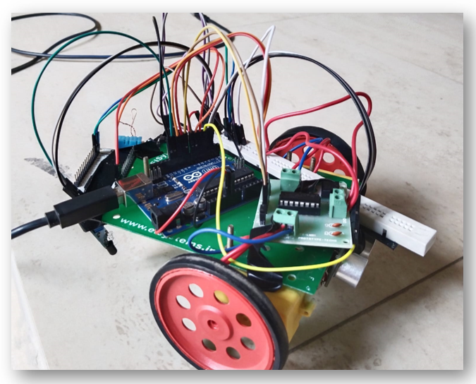

# Zen - Sensor-Based Robo

Zen is a basic sensor-based robot that operates within a defined region of interest to find a suitable coordinate to settle down. The robot utilizes various sensors, including a Wifi module, DHT11 (Temperature and Humidity Sensor), PIR sensor (Infrared Motion Sensor), and motors, to perform its tasks.

## Code Explanation

- `zen.ino`: This file contains the main Arduino code for Zen. It reads sensor data from PIR sensor, DHT11 and HC-SR04, calculates temp., humidity, and position scores based on sensor readings, and performs motion using BO motors.
- `wifi_esp.ino`: This file is responsible for handling the Wifi connection and measuring Wifi signal strength using the ESP8266 Wifi module.

## Setup

### Components Used:

- Arduino Uno - 1 Nos
- ESP8266 Wifi module - 1 Nos
- DHT11 Temperature and Humidity Sensor - 1 Nos
- L293D motor driver - 1 Nos
- IR sensor module - 2 Nos
- HC-SR04 Ultrasonic Sensor - 1 Nos
- BO motor - 2 Nos
- Motor wheel - 2 Nos
- Castor wheel - 1 Nos
- Robot chassis - 1 Nos
- Wires
- Screws

## Learnings

- Selecting the right sensors is crucial for accurate and reliable data collection.
- Calibration and testing in different environments are essential for accurate data and reliable performance.

  

  

